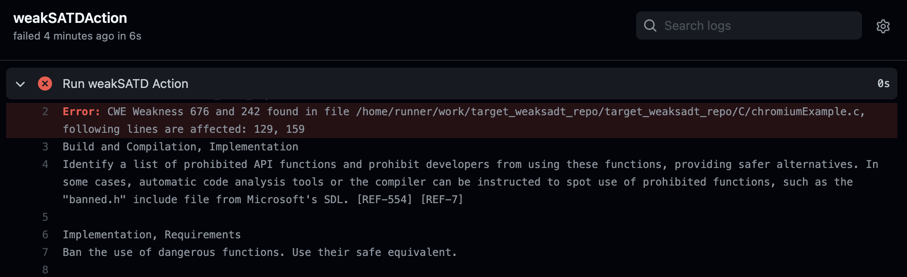

# Target sources repository

This folder is part of the **WeakSATD: Detecting Weak Self-admitted Technical Debt -- Replication Package**, i.e., the anonymized replication package attached to the following submission:

"WeakSATD: Detecting Weak Self-admitted Technical Debt", Anonymous author(s), submitted to the NIER track of the 44th IEEE/ACM International Conference on Software Engineering (ICSE 2022).

## Content

* `C` folder -- target (small set of) sources to be analyzed by the `WeakSATD` tool. The sources are written by using the C language and they are examples of real-world code taken from the [Chromium project](https://github.com/chromium) repository.
* `.github/workflows/main.yml` -- minimal working configuration file used to setup the usage of the `WeakSATD` tool to analyze the sources in CI/CD workflows. It requires the existence of the **public GitHub repository** `WeakSATD-Action` which leverages the [GitHub Actions](https://github.com/features/actions) platform.

## Quick Start

**Requirements**

* `Git` on your local machine;
* `GitHub` account;
* `WeakSATD-Action` tool available as a **public** GitHub repository (follow the instructions reported in the `weak_satd_repo/README.md` file).

**Instructions**

* create a local `git` repository in this folder;
* create a remote repository in `GitHub` using your own `<account>` and then link it to the local one;
```
git remote add origin git@github.com:<account>/target_repo.git
```
* edit the `yml` configuration file to refer to the existing `WeakSATD-Action` repository;
```yml
uses: <account>/WeakSATD-Action@v0.0.3
```
* commit and then push the changes;
```
git add .
git commit -m 'my first WeakSATD check in a CI/CD workflow'
git push origin master
```

The job executed after checking out the current version of the sources emits the  outcome shown in the screenshot below. The screen shows that the `WeakSATD` tool identifies two weaknesses within SATD instances found in the `C/chromiumExample.c` source file (lines 129, 159):
* [CWE-Issue 676](https://cwe.mitre.org/data/definitions/676.html): Use of Potentially Dangerous Function;
* [CWE-Issue 242](https://cwe.mitre.org/data/definitions/242.html): Use of Inherently Dangerous Function.

<p></p>
